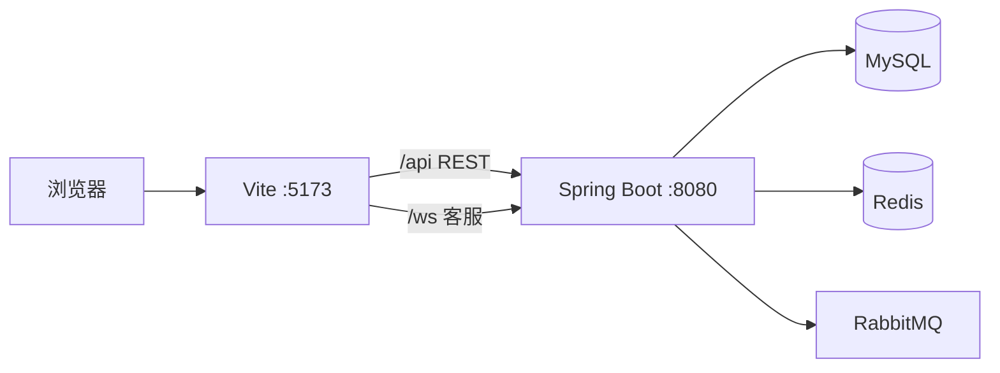

<p align="center">
  
</p>

<h1 align="center">橙子市集</h1>

<p align="center"><strong>简单生活，好物即达</strong></p>

<p align="center">
  面向真实购物路径的电商前端 · 从逛到买，从客服到后台，一条链路走完
</p>

<p align="center">
  
  
  
  
</p>

<p align="center">
  <a href="https://github.com/CzlRx/OrangeMarketBackend">后端仓库</a>
  ·
  <a href="#快速开始">快速开始</a>
  ·
  <a href="#页面地图">页面地图</a>
</p>

---

橙子市集不是模板商城的堆砌页。首页把商品放在第一位，分类、搜索、加购、结算、支付、收货、评价串成完整闭环；游客可以先逛后登，登录后再合并购物车。人工客服走 WebSocket，管理员有发货、封禁和客服工作台。

视觉上克制：主色 `#ff7a1a`，大量留白，桌面顶栏 + 移动端底栏，骨架屏和空状态覆盖主要列表。

## 能做什么

| 模块 | 说明 |
|------|------|
| 逛 | 首页运营位、分类、关键词搜索、价格/销量排序、商品详情与评价 |
| 买 | 游客本地购物车、登录合并、立即购买、地址结算、模拟支付 |
| 履约 | 订单列表与详情、取消、确认收货、待评价提交 |
| 我的 | 资料、地址、收藏、浏览足迹、搜索历史 |
| 客服 | 用户咨询页 + 全局悬浮入口；管理员抢单工作台，REST + WebSocket |
| 后台 | 按订单发货、按用户封禁（需 `ADMIN` 角色） |

## 技术选型

| 层 | 选择 | 原因 |
|----|------|------|
| 视图 | React 19 | 页面按路由拆分，状态用 Context 而不是再引一套 store |
| 构建 | Vite 8 | 开发代理 `/api`、`/ws` 到后端 `8080` |
| 语言 | TypeScript strict | 与后端 DTO 对齐，类型集中在 `src/types.ts` |
| 路由 | react-router-dom 7 | 嵌套布局 + 登录/管理员守卫 |
| 请求 | 原生 `fetch` | 统一封装在 `src/lib/api.ts`，无 axios |
| 实时 | 浏览器 WebSocket | `src/lib/chatSocket.ts` 单例，心跳与断线重连 |
| 样式 | `src/styles.css` | 自建 Design Token，无组件库 |

配套后端：[OrangeMarketBackend](https://github.com/CzlRx/OrangeMarketBackend)（Spring Boot 4 / Java 21）。

## 页面地图

| 路径 | 谁能进 | 做什么 |
|------|--------|--------|
| `/` | 公开 | 首页：轮播、分类、热卖与新品 |
| `/catalog` | 公开 | 商品列表，筛选与分页 |
| `/product/:productId` | 公开 | 详情、评价、加购、立即购买、收藏 |
| `/login` | 公开 | 手机号 + 图形验证码 + 短信验证码 |
| `/cart` `/checkout` | 登录 | 购物车与结算 |
| `/payment/:orderId` | 登录 | 模拟支付（倒计时） |
| `/orders` `/orders/:orderId` | 登录 | 订单列表与详情 |
| `/reviews` | 登录 | 待评价商品 |
| `/profile` `/addresses` | 登录 | 个人中心、收货地址 |
| `/favorites` `/history` | 登录 | 收藏与浏览足迹 |
| `/service` | 登录 | 用户端人工客服 |
| `/admin` | 管理员 | 发货、封禁 |
| `/admin/service` | 管理员 | 客服大厅抢单与会话 |

未登录访问受保护路由会跳到 `/login?redirect=...`。非管理员打开 `/admin*` 会回到 `/profile`。

## 链路怎么走



开发时前端只请求相对路径 `/api` 和 `/ws`，由 Vite 转到本机后端。生产环境同样走 `/api`、`/ws`，需要 Nginx 等反向代理到后端。

鉴权：JWT 存在 `localStorage`（`orange_market_token`），请求头 `Authorization: Bearer {Token}`。接口统一形状：

```json
{ "code": 0, "message": "success", "data": {}, "timestamp": 0 }
```

`code === 0` 为成功；遇到 401 会清会话并回到登录页。

订单状态：

```text
pending_payment → pending_shipment → pending_receipt → pending_review → completed
```

## 快速开始

需要本机已启动后端（默认 `http://localhost:8080`），以及 Node.js 18+。

```bash
git clone https://github.com/CzlRx/OrangeMarketFrontend.git
cd OrangeMarketFrontend
npm install
npm run dev
```

打开 [http://localhost:5173](http://localhost:5173)。`vite.config.ts` 已开启 `host: true`，同一局域网可用本机 IP 访问。

| 命令 | 作用 |
|------|------|
| `npm run dev` | 开发服务器，端口 5173 |
| `npm run build` | `tsc --noEmit` 后打包 |
| `npm run preview` | 预览 `dist` |

没有 `.env`。API 地址不写死域名，始终走相对路径。

登录走「图形验证码 → 短信验证码 → 签发 Token」。短信由后端对接阿里云，需在后端配置密钥。演示数据里预置了 `13800138001` 等账号；管理员没有单独登录口，把 `user_account.role` 设为 `ADMIN` 即可进入后台。首次使用未注册手机会自动开户。

游客加购写入 `localStorage`（`orange_market_guest_cart`），登录后调用 `POST /api/cart/merge` 合并。

## 目录

```text
src/
├── App.tsx                 路由与鉴权守卫
├── styles.css              设计系统与全站样式
├── types.ts                共享类型
├── components/             顶栏、卡片、客服气泡、骨架屏等
├── pages/                  18 个页面
├── lib/
│   ├── api.ts              REST 封装
│   ├── chatSocket.ts       客服 WebSocket
│   └── format.ts           价格、时间、订单文案
└── state/                  Auth / Cart / Category / Toast
```

接口字段级说明见 [FRONTEND_DEVELOPMENT_DOC.md](./FRONTEND_DEVELOPMENT_DOC.md)。客服与部分约定以当前代码为准，文档若滞后请以 `src/lib/api.ts` 为准。

## 相关仓库

| 仓库 | 角色 |
|------|------|
| [OrangeMarketFrontend](https://github.com/CzlRx/OrangeMarketFrontend) | 本仓库，用户端与管理端 UI |
| [OrangeMarketBackend](https://github.com/CzlRx/OrangeMarketBackend) | 商品、订单、鉴权、客服 API |
